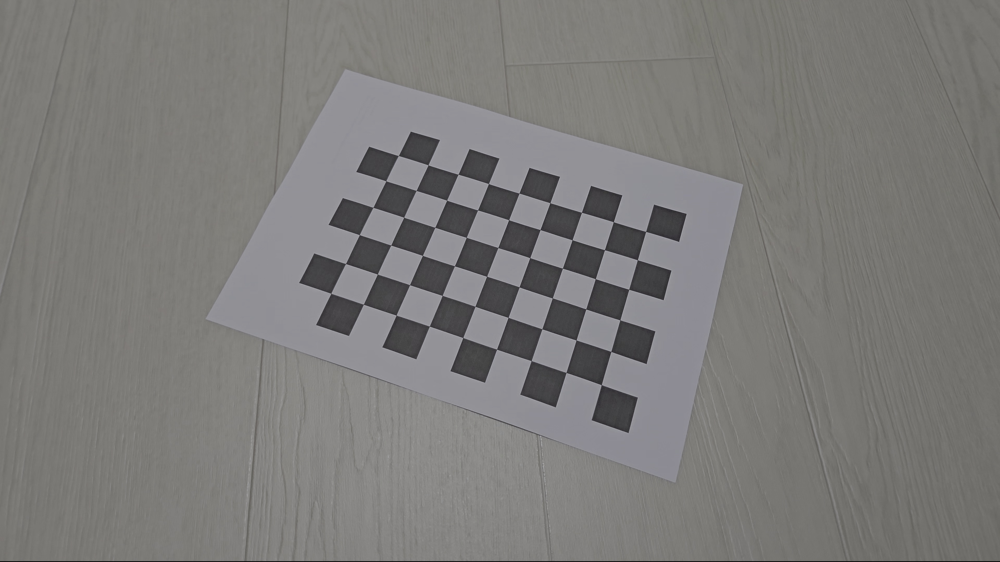
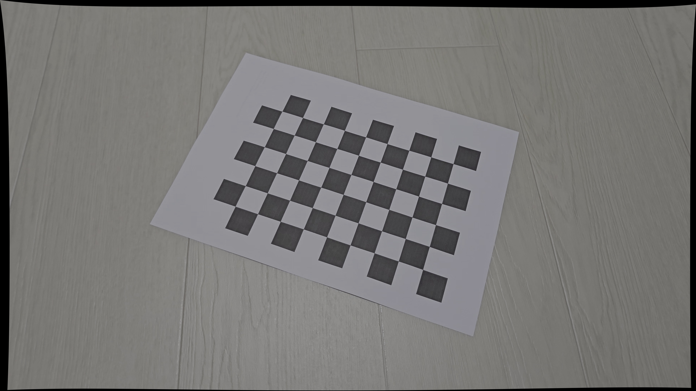
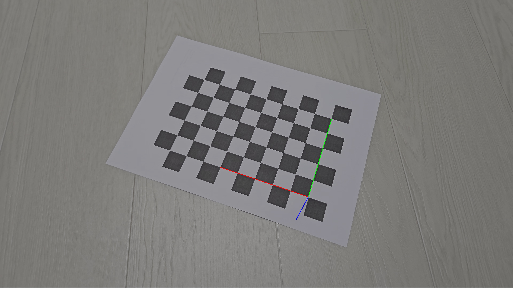
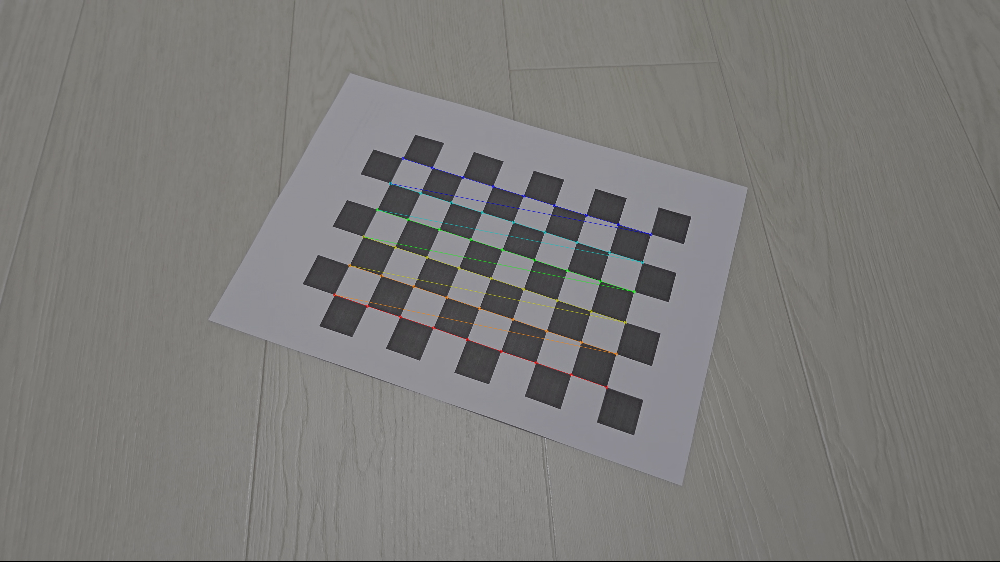

# Camera Calibration and Lens Distortion Correction (OpenCV)

## Introduction

This project performs camera calibration and lens distortion correction using OpenCV.  
A chessboard pattern was used to estimate intrinsic camera parameters, and the calibration results were applied to correct lens distortion in captured images.

---

## Origianl Video

https://www.youtube.com/watch?v=ODB6fhd_y3E

---

## Camera Calibration

A chessboard pattern (9 × 6 internal corners) was printed on A4 paper and recorded from multiple viewpoints using a smartphone camera.  
Detected chessboard corners were used to compute camera intrinsic parameters.

### Calibration Result

**Intrinsic camera parameters:**
* fx = 2546.34781492
* fy = 2577.04269522
* cx = 1934.55003442
* cy = 1260.84383221
* rmse = 2.2307095

**Distortion coefficients:**
[0.07704224, -0.0137147, 0.00148957, 0.00359463, -0.09818101]

**Camera matrix:**
[[2546.34781492 0. 1934.55003442]
[ 0. 2577.04269522 1260.84383221]
[ 0. 0. 1. ]]

---

## Distortion Correction

Lens distortion correction was applied using the estimated intrinsic parameters.

### Original Image

### Undistorted Image

---

## Camera Coordinate Axis Visualization

The camera coordinate axes (X, Y, Z) were visualized on the chessboard plane using pose estimation.

---

## Chessboard Corner Detection Example

Example of detected chessboard corners:

---

## How to Run

Choose Video:
`chessVideo.mp4`

Run camera calibration:
`python camera_calibration.py`

Run distortion correction:
`python distortion_correction.py`

---

## Features

- Chessboard corner detection from calibration video
- Camera intrinsic parameter estimation
- Lens distortion correction
- Camera coordinate axis visualization
